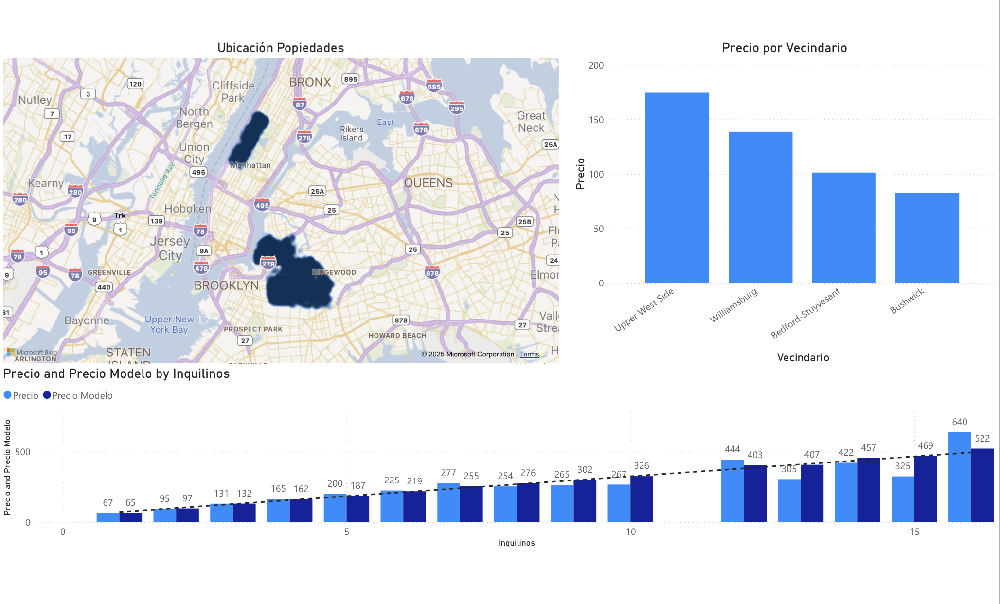

# 🏠 Predicción de Precios de Airbnb con Modelos Lineales Mixtos (R)

Este proyecto implementa un **Modelo Lineal Mixto (LMM)** en **R** para predecir los precios de propiedades en Airbnb.  
Se incluyen **efectos aleatorios por intercepto y por pendiente** para capturar la variabilidad entre vecindarios.

---

## 📊 Conjunto de Datos

- **Fuente:** Kaggle – Airbnb Dataset  
- **Tipo de datos:** Propiedades, precios, características de alojamiento  
- **Objetivo:** Predecir el precio de alojamiento según características estructurales y ubicación

---

## 🧩 Preprocesamiento

1. **Limpieza de datos:**  
   - Eliminación de valores nulos  
   - Conversión de variables categóricas a factores (`room_type`, `property_type`, `neighbourhood`, `city`, `cancellation_policy`)  
   - Conversión de `log_price` a precio normal (`price`)

2. **Filtrado de datos:**  
   - Selección de los 5 vecindarios con más registros  
   - Eliminación de filas con NA

---

## 🏗️ Modelado

- **Modelo lineal mixto (lmer):**
  - Variables fijas: `room_type`, `accommodates`, `bathrooms`  
  - Efectos aleatorios: intercepto y pendiente por vecindario `(1 + accommodates | neighbourhood)`  
- Librerías utilizadas:
  - `lme4`, `tidyverse`, `ggplot2`, `sjPlot`  

---

## 📈 Resultados y Visualización

- **Predicciones por vecindario:** Se generaron gráficos comparando **valores reales vs estimados** por vecindario y capacidad de alojamiento.  
- **Modelos comparados:**  
  - Con interceptos y pendientes aleatorias  
  - Solo interceptos aleatorios  
  - Solo efectos fijos  

- Las predicciones se guardaron en `predicciones_modelo.csv` y `predicciones_long.csv` para análisis posteriores.

- Los gráficos muestran cómo el modelo captura la variabilidad entre vecindarios y la relación entre número de huéspedes y precio.

---

## 📊 Dashboard en Power BI

Se desarrolló un **dashboard interactivo en Power BI** para visualizar los precios y patrones de los alojamientos de Airbnb.  
El dashboard permite explorar:

- Distribución de precios por vecindario  
- Comparación entre diferentes tipos de habitaciones  
- Relación entre número de huéspedes y precio  
- Visualización de efectos aleatorios por vecindario  

> ⚠️ Imagen de referencia (dashboard local):

> Nota: El dashboard se encuentra en Power BI Desktop; no se dispone de enlace público.

---

## 🧠 Conclusión

- El **LMM en R** es adecuado para datasets jerárquicos como Airbnb (agrupados por vecindario).  
- Los efectos aleatorios permiten capturar diferencias locales y ajustar mejor las predicciones.  
- Futuras mejoras:
  - Añadir más efectos aleatorios (por anfitrión o tipo de propiedad)  
  - Transformaciones logarítmicas de precios  
  - Comparar con modelos no lineales o de machine learning

---

## ⚙️ Tecnologías

- R (versión >= 4.0)  
- Librerías: `lme4`, `tidyverse`, `ggplot2`, `sjPlot`, `dplyr`  

---

## 📚 Créditos

**Autor:** Álvaro Salgado  
**Proyecto:** Predicción de precios de Airbnb usando Modelos Lineales Mixtos (R)  
**Dataset:** Kaggle – Airbnb
